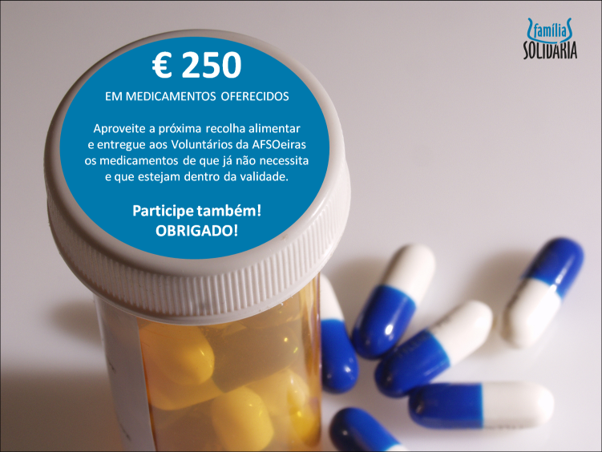

Na recolha de Maio foi possível entregarmos medicamentos no valor de 250 Euros à Farmácia Solidária da paróquia de S. Julião da Barra.

===

Na recolha de Maio foi possível entregarmos medicamentos no valor de 250 Euros à Farmácia Solidária da paróquia de S. Julião da Barra. Uma ajuda muito necessária para quem necessita de medicação regular e não tem possibilidade de pagar. Participe, divulgando junto dos seus contactos e entregando os medicamentos válidos que já não utiliza ao voluntário AFSO da sua zona. 