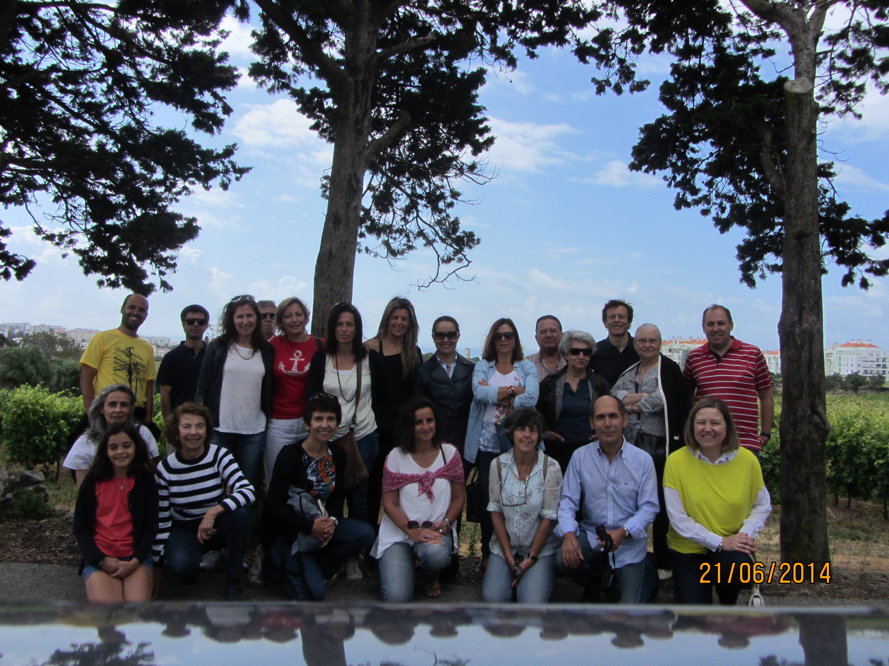

A Câmara Municipal de Oeiras convidou a Associação Família Solidária de Oeiras para uma visita à produção do Vinho de Carcavelos. 

===

A Câmara Municipal de Oeiras convidou a Associação Família Solidária de Oeiras para uma visita à produção do Vinho de Carcavelos. 

A visita começou às 10h30 no Casal da Manteiga (Estação Agronómica Nacional) e terminou cerca das 13h00 no Lagar do Azeite - nos Jardins do Palácio Marquês de Pombal. 

Os Amigos, Sócios e Voluntários puderam ainda fazer um agradável piquenique partilhado neste belíssimo jardim. 