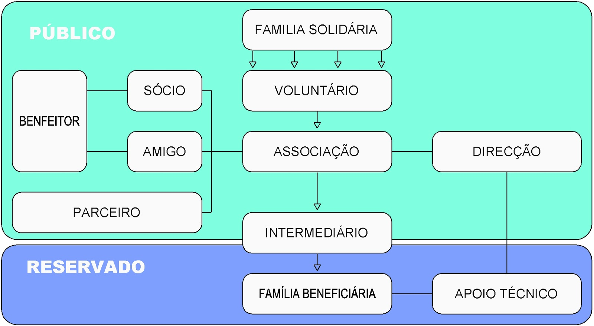

[Folheto AFSO](../user/pages/intervenientes/Folheto_AFSO.pdf)

[Princípios Gerais](../user/pages/intervenientes/PrincipiosGerais.pdf)

[Regulamento Voluntários AFSO](../user/pages/intervenientes/RegulamentoVoluntariosAFSO.pdf)

##Famílias Solidárias
Oferecem mensalmente uma pequena contribuição em bens alimentares.

##Associados
Asseguram o funcionamento institucional da AFSO, contribuindo com quotizações, participando na sua organização do projecto.

##Voluntários
Assumem a angariação de “famílias solidárias” na vizinhança da sua residência ou noutras comunidades de que faça parte, executando a recolha mensal de alimentos, o seu acondicionamento e distribuição.

##Responsáveis de zona
Acompanham o trabalho por bairros, assistem as famílias solidárias da sua zona no esclarecimento de questões relativas ao projecto e acompanham reforçam a acção dos voluntários.

##Benfeitores
Contribuem para os fins do projecto com donativos em dinheiro.

##Amigos
Associados ao projecto sem qualquer compromisso, mantêm-se Informados, contribuem na divulgação e promoção do mesmo, constituindo uma reserva voluntária para acções ou contribuições pontuais.

##Beneficiários
Famílias seleccionadas que recebem durante um período limitado de tempo o apoio alimentar do projecto Família Solidária.

##Parceiros
Entidades locais (nacionais ou multinacionais) que contribuem com bens ou serviços, mediante protocolos de parceria.

##Intermediário
Sinalizam uma família, acompanhando-a, fazem a ligação com o Projecto e com a Direcção.

##Organigrama AFSO

