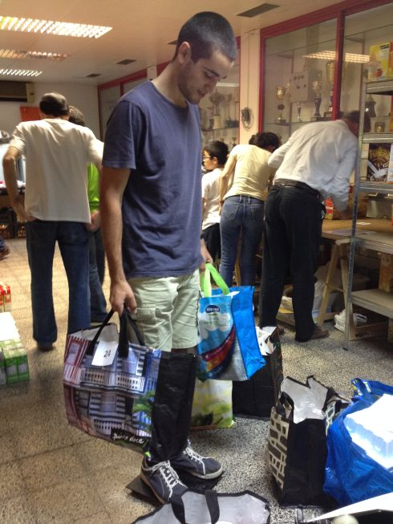

O projecto família solidária de Oeiras iniciou-se com um pequeno grupo ligado à paróquia de Nossa Senhora da Purificação de Oeiras, que se foi alargando a pessoas de outras origens, unidas num ideal comum e numa vontade de intervir.

Numa fase prévia estabeleceram-se os primeiros contactos com entidades intervenientes na área, nomeadamente as que fazem distribuição alimentar, no sentido de auscultar a pertinência e necessidade do projecto.

Em Outubro de 2012 constituiu-se a Associação Família Solidária, pretendendo-se com a aquisição de personalidade jurídica e instituição de Órgãos Sociais, formalizar a administração do projecto, tornar transparentes e democráticas as opções de gestão e o manuseamento dos fundos recolhidos.

##Objectivos
O projecto Família Solidária pretende apoiar alguns com pequenos contributos de muitos e é um apoio de emergência, limitado no tempo e acautelando a exposição das famílias apoiadas.

É dirigido em particular a famílias com dificuldades económicas bruscas e que não se enquadram nos sistemas de apoio social.

O projecto tem como objectivo o envolvimento da comunidade num gesto continuado de solidariedade social, criando dinâmicas de entreajuda em vizinhança, locais de trabalho ou outro tipo de comunidades.

##Beneficiários
- Famílias que sofreram uma diminuição brusca nos rendimentos, fora dos circuitos de apoio social, afectados por desemprego, doença, divórcio, acidente, ou outras dificuldades.
- Famílias tendencialmente estruturadas, que precisam de ajuda mas não se querem expor, procuram soluções mas ainda não têm resposta.

O projecto apoia indirectamente todas as pessoas dependentes das redes existentes, na medida em procura reduzir a sobrecarga das mesmas ao retirar da sua esfera as famílias que vier a suportar.

O projecto propõe-se oferecer um apoio simples, mas que possa fazer a diferença para estas famílias enquanto se reestruturam e procuram novos meios de subsistência.

O projecto não se dirige, deliberadamente, aos casos mais crónicos, de reprodução continuada de pobreza, que requerem um apoio mais estruturado, de instituições com diversas valências e num envolvimento mais explícito entre técnicos e beneficiários.

##Apoio a prestar
O apoio a prestar será essencialmente de natureza alimentar – produtos “secos”, congelados e frescos.

Não se exclui a possibilidade de contribui com produtos de higiene/saúde básica, na medida em que se obtenham ofertas dos mesmos ou haja disponibilidade financeira para a sua aquisição.

Apoios doutra natureza, como consultas e exames médicos, apoio jurídico ou outros, também dependerão das disponibilidades encontradas e parcerias estabelecidas.

Havendo disponibilidade financeira poderão ainda prestar-se outros apoios como seja na aquisição de medicamentos, no pagamento de contas ou até de propinas escolares.

##Duração do apoio
O apoio a prestar assume-se como sendo um apoio de emergência, e como tal não faz sentido a sua perpetuação

A duração prevista deste apoio será de 1 ano, podendo, excepcionalmente, considerar-se a extensão do apoio quando tal se justifique, nomeadamente havendo data determinada para ultrapassagem da situação de carência (conclusão de baixa, início de emprego, conclusão de formação, cessação de um encargo, etc.)

##Intervenientes
O projecto família solidária assenta na doação gratuita de bens alimentares por famílias, no trabalho de voluntários que recolhem os bens, processam e distribuem alimentos, nas receitas geradas por quotas, donativos e acções de angariação de fundos, em parcerias com agentes locais e outros, para satisfazer necessidades básicas de famílias em dificuldade.

##Sinalização e Selecção
As famílias que se pretende apoiar primeiramente são aquelas que de algum modo estão excluídas dos sistemas de apoio. Procura-se em particular a detecção daquelas famílias que, não se querendo expor, vivem situações de chamada “pobreza oculta”.

Este projecto distingue-se pela discrição no tratamento destas situações e pela possibilidade de prestar o apoio preservando o anonimato da família
em relação aos membros da associação.

O processo de selecção passará pela colaboração entre a direcção e a técnica assistente social ao serviço do projecto, mediante critérios previamente definidos. A identidade da família poderá ser apenas do conhecimento da assistente social e da pessoa que sinalizou o caso e o apresentou à associação.

Para a sinalização das famílias contar-se-á com a colaboração de diversas entidades, nomeadamente:

- Priores das paróquias da zona
- Assistentes sociais de outras instituições (Juntas de Freguesia, Misericórdia, CSPO, etc.)
- Agentes de Saúde
- Agentes Educativos
- Agentes Desportivos

Em todo o processo, e considerando a especificidade de cada caso, estabelecer-se-á o mínimo contacto necessário, através da assistente social, do agente do contacto, de alguém designado pela família ou através de um voluntário do projecto.

##Coordenação com outras entidades
Deverá manter-se um contacto permanente com outras instituições operantes no território de modo a não duplicar acções, a aprender e compreender, a criar sinergias, a saber encaminhar casos inadequados ao propósito do projecto ou encaminhar aspectos de apoio que transcendam a capacidade/vocação do projecto.

Esta coordenação far-se-á tanto a um nível técnico – entre assistentes sociais, como ao nível das coordenações, conforme se adeqúe.